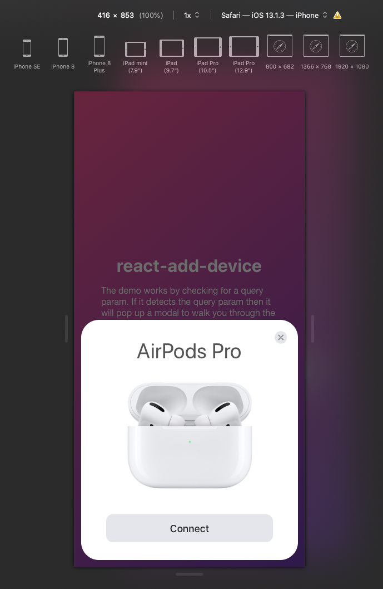

# react-add-device

> "you can't just copy Apple UI". CSS machine go brrr - Aristotle

## What is it

TLDR: Replica of syncing bluetooth devices on iOS.

I'm a huge fan of Apple's bluetooth pairing service. Syncing Airpods or other Apple devices is not only elegant but highly functional. Unfortunately the browser\* is not given access to things like bluetooth. The way this works is by query parameters. If you load `http://localhost:3000/?add=Airpods+Pro` it will trigger the popup and walk you through the 2 step process.

Since Apple has [no intention](https://webkit.org/status/#feature-web-bluetooth) of supporting bluetooth in the browser anytime soon, my idea would be that a user's device could have an NFC tag on it, which links them to a dashboard that presents them with this. Of course that has it's own set of problems.

\*_Chromium browsers do support bluetooth_

## Development

Built with [react](https://reactjs.org/). You'll need [node.js](http://nodejs.org/) & [yarn](https://yarnpkg.com/).

Utilizes these great libraries [react-router-dom](https://reacttraining.com/react-router/web/guides/quick-start) and [react-transition-group](https://reactcommunity.org/react-transition-group/).

```bash
# clone repo
git clone https://github.com/SunstroUS/react-add-device.git

# install dependencies
yarn install

# start app on port 3000
yarn start
```

## Current look



## License

<a href="/LICENSE.md">MIT</a>
